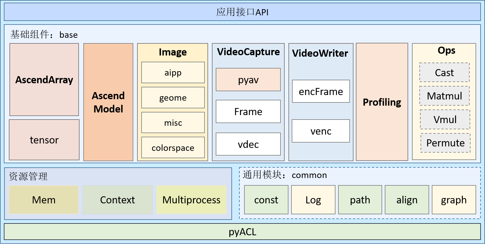
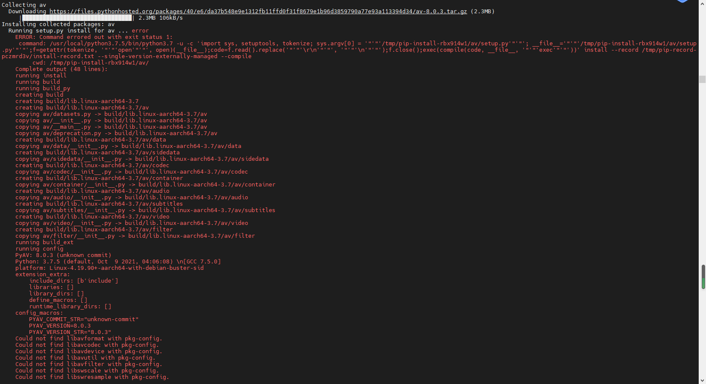
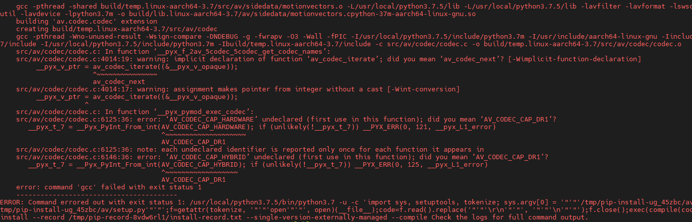
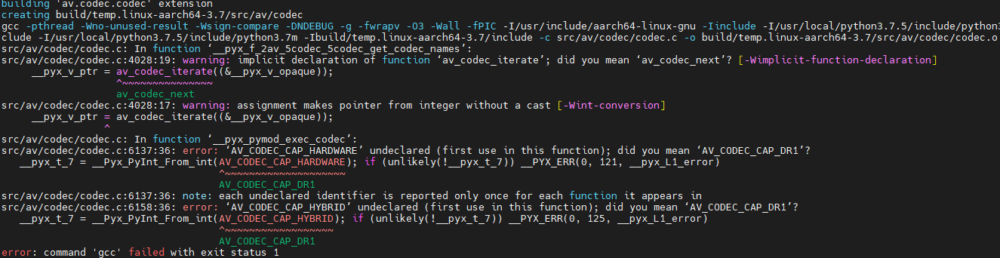
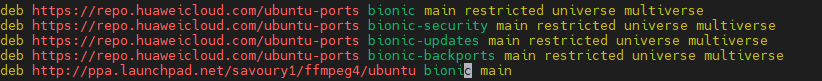
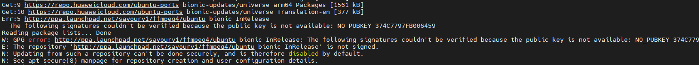
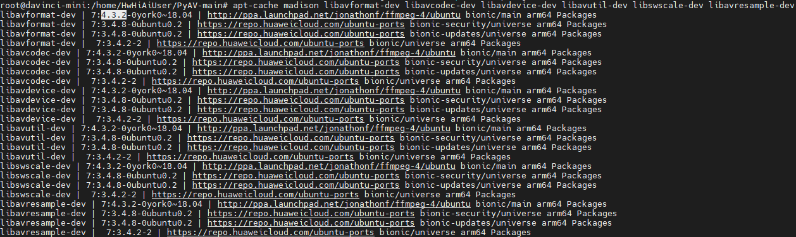
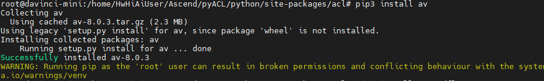

## 1 简介

### 1.1 背景

该项目通过Ascend Compute Language Python(pyACL) API实现Ascendfly推理框架，封装了一系列易用的python接口，目的是简化用户使用pyACL开发流程，加速算法迁移部署。以下对ascendfly相关接口功能、依赖安装和使用进行简要说明。

### 1.2 主要功能

本软件提供以下功能：

1. 封装了Context、Memory资源类，简化资源调度与分配。
2. 封装了AscendArray类，类似numpy.ndrray在device上进行图片和tensor管理，实现数据统一性。AscendArray自动管理数据内存，无需用户操作。
3. 封装了VideoCapture和VideoWriter类，获取实时H264（MAIN LEVEL without B frame）协议的RTSP/RTMP码流，并通过Ascend310芯片硬解码，或逐帧把图片编码为264/265码流。
4. 封装了Image类，实现图片解码、缩放、剪切、padding等图像处理功能。
5. 封装了Model类执行模型推理功能。
6. 封装了Profiling类，方便进行模型性能调优。
7. 其它如单算子调用，后处理等功能。

### 1.3 程序架构

Ascendfly系统级封装主要包括以下模块（module）。

1. 资源管理（resource）:

   resource包括内存模块（mem）、context和线程/进程资源（thread/multi-process）。mem主要是Memory对象，进行内存申请和释放；context主要实现Context资源申请和释放等；multiprocess主要做并行加速。

2. 数据模块（data）：

   主要包括ascendarray和tensor，ascendarray实现类似numpy.ndarray的AscendArray对象，**完成整个框架图像、tensor数据的统一性**，并具备不同于ndarray的to_numpy、to_ascend、clone方法实现numpy.ndarray数据和对象的复制。tensor主要实现imgs2tensor和tensor2imgs两个函数的功能，完成3维图片和4维tensor的转换，用于组batch进行推理或tensor heatmap显示。

3. 模型（model）：
   model模块封装了AscendModel，用来进行模型推理。模型实例化后，通过model.tensor获取输入输出tensor name，通过feed_data方法给模型数据，通过run方法实现推理，通过get_tensor_by_name获取输出tensor数据。

4. 图像模块（image）：

   涉及到图像预处理（动态aipp），图像色域空间转换（colorspace），图像几何变换（geome）和图像显示（misc）。

5. 视频模块（video)：
   video模块封装了VideoCapture类用于H264/H265 RTSP/RTMP视频解码，使用方式基本与opencv VideoCapture基本一致，实现方式是通过pyav进行拉流解包，vdec（封装了dvpp解码功能）进行解码。video模块还封装了VideoWriter类，用于把单帧yuv图像编码成H264/265的实时视频流，使用方式与opencv VideoWriter有轻微差别，实现方式是把AscendArray的单帧图像数据通过venc（封装了dvpp编码功能）进行编码，保存视频流到本地。

6. 后处理（post_process)：
   后处理部分实现了bbox_overlaps函数用于计算bbox的iou，nms用于计算NonMaximumSuppression，imshow、imshow_det_bboxes等显示检测的目标框或把目标框和confidence写在图片上并保存下来。

5. 算子模块（ops）：
   算子部分主要实现blas库算子调用和Argmax、Cast、Transpose、FFT等算子调用。

7. 性能调优（profiling)：
   模块封装了Profiling类可以更简单的实现算子、模型性能调优，可以直观地显示各算子执行耗时并加以排序。

整体系统设计如下图所示：




## 2 环境依赖及安装指导

### 2.1 环境依赖

ascendfly需要依赖**pyACL（CANN 21.0.1及以上）**、[**pyav**](https://github.com/PyAV-Org/PyAV)和[**PIL**]()。以下简要介绍相关依赖软件安装过程。

表2-1 环境要求

| 环境要求 | 说明                                                        |
| -------- | ----------------------------------------------------------- |
| 硬件环境 | Atlas 300（型号3000 或 3010）/Atlas 800（型号3000 或 3010） |
| 操作系统 | CentOS 7.6/Ubuntu18.04                                      |

表2-2 环境依赖软件及软件版本

| 软件名称 | 软件版本                              |
| -------- | ------------------------------------- |
| pyACL  | （安装CANN 21.0.1 及以上，会自带安装pyACL ） |
| numpy  | >=1.14 |
| pyav   | >=8.0.2 |
| PIL    | >=8.2.0 |
| objgraph  | >=3.5.0 |
| prettytable | >=2.1.0 |
| opencv （可选）  | >=3.4.2 |


### 2.2 CANN安装

pyACL作为ACL python API编程接口，开放context创建、内存申请、模型和算子等功能，ascendfly推理框架依赖pyACL提供的API。具体环境安装方法参考[《CANN 软件安装指南》](https://support.huaweicloud.com/instg-cli-cann/atlascli_03_0001.html), 安装CANN后，进行[环境变量配置](https://support.huaweicloud.com/asdevg-python-cann/atlaspython_01_0006.html)。

### 2.3 Ascendfly安装
ascendfly会自动安装相关依赖，无需另外操作，通过以下命令直接安装

```shell
pip install ascendfly
```

### 2.4 opencv安装过程（可选）

如果是ARM平台，编译安装opencv-python前需要先安装python3.7.5

- **步骤 1** 下载opencv-python

   https://pypi.org/project/opencv-python/4.4.0.46/#files
   
- **步骤 2**  解压opencv-python

   tar -zxvf opencv-python-4.4.0.46.tar.gz && cd opencv-python-4.4.0.46
   
- **步骤 3**  编译opencv-python

   python3.7.5 setup.py install


### 2.5 pyav手动安装
部分平台，会由于**pyav**自动安装缺少`libavformat`、`libavcodec`等依赖导致pyav安装失败，从而导致ascendfly安装失败，这时需要手动安装**pyav**以及`libavformat`、`libavcodec`等依赖。
由于安装过程可能会涉及ffmpeg版本问题，过程比较复杂，请参考附录[4.2 pyav手动安装](#4.2 pyav手动安装)


## 3 使用指导

### 3.1 使用约束

本章节介绍Ascendfly限制约束。

表3-1 使用约束

| 名称     | 规格约束                                                     |
| -------- | ------------------------------------------------------------ |
| pyACL    | 请参考[《应用开发指南(Python)》](https://support.huaweicloud.com/asdevg-python-cann/atlaspython_01_0001.html) |
| context  | context通过device id创建，每个context对应唯一device id.                        |
| VideoCapture | 目前只支持rtsp协议，拉取H264（去除B帧）的视频流              |


### 3.2 使用前准备

运行前，需要先进行模型的转换和配置文件修改。模型和配置文件的存放位置可自定义。

#### 3.2.1 模型准备

- **步骤 1 :** 模型下载

  首先，获取所用到的原始网络模型、权重文件和aipp_cfg文件（相关模型下载可参考tools/modelzoo链接），并将其存放到开发环境普通用户下的任意目录，例如：/home/model/


- **步骤 2:**  模型转换

  请参考[ATC工具参数说明](https://support.huaweicloud.com/tg-Inference-cann/atlasatc_16_0007.html)进行aipp配置，以及把caffe、TensorFlow或onnx模型转换为ascend平台om模型（可参考tools/convert脚本）。

#### 3.2.2 利用ascendfly API进行开发

可参考demo中样例和[API使用手册](./ascend/index.html)，利用ascendfly API进行推理流程开发。

### 3.3 demo运行

进入demo目录下，对要运行demo的device id和video_stream_path等配置进行修改，运行测试demo

```shell
python3.7.5 yolov3_caffe_demo.py
```

   

## 4 附录
### 4.1 Ascendfly API
请参考[API doc](./ascend/index.html)。

### 4.2 pyav手动安装
pyav自动安装失败，缺少`libavformat`、`libavcodec`等依赖的`ERROR`错误时，可参考如下步骤手动安装**pyav**。


- **步骤 1** 安装`libavformat`、`libavcodec`、`libavdevice`、`libavutil`、`libavfilter`、`libswscale`、`libswresample`：
   
   ```shell
   apt-get install -y python-dev python-virtualenv pkg-config
   apt-get install -y \
      libavformat-dev libavcodec-dev libavdevice-dev \
      libavutil-dev libswscale-dev libavresample-dev
   ```
   如果使用`pip3 install av`可以成功，**后续步骤跳过**。如果出现以下错误，则说明pip3尝试安装的`ffmpeg版本<4.x`的。
   
   或
   
   
   以上错误这说明`libavcodec-dev`等包的版本太低, 所以需要安装`ffmpeg`以及更新其他依赖来解决这个问题，可以参考issue：[Rob Savouy's PPA](https://github.com/aiortc/aiortc/issues/326)和[Docker install of aiortc](https://github.com/aiortc/aiortc/issues/327), 或者参考后续步骤。
   
   ```shell
   //检查apt中libavformat、libavcodec、libavdevice、libavutil、libavfilter、libswscale、libswresample版本
   apt-cache madison ffmpeg
   apt-cache madison libavformat-dev libavcodec-dev libavdevice-dev libavutil-dev libswscale-dev libavresample-dev
   ```
   
- **步骤 2** 更新`ffmpeg`和`av`依赖源，安装`software-properties-common`。
   
   ```shell
   apt-get update && apt-get install -y software-properties-common
   ```
   
- **步骤 3** 先添加**PPA**的源，然后通过**PPA**单独安装`ffmpeg`以及`libavcodec`等。
   
   1. **方法1**：对于Ubuntu18.04，添加`deb http://ppa.launchpad.net/savoury1/ffmpeg4/ubuntu bionic main `，[参考链接](https://launchpad.net/~savoury1/+archive/ubuntu/ffmpeg4)
   
      ```shell
      vim /etc/apt/sources.list
      ```
   
      
   
   2. **方法2**：命令方式
   
      ```shell
      add-apt-repository ppa:jonathonf/ffmpeg-4
      apt-get update && apt-get upgrade -y
      ```
   
   如果`apt-get update`出现以下错误，
   
   
   
   解决方法是：
   
   ```shell
   gpg --keyserver keyserver.ubuntu.com --recv 5523BAEEB01FA116 //(这个公钥是上述报错的提示)
   gpg --export --armor 5523BAEEB01FA116 | sudo apt-key add -
   ```
   然后再执行以下命令更新源：
   ```shell
   apt-get update && apt-get upgrade -y
   apt update && apt upgrade
   ```
   
- **步骤 4** 查看`ffmpeg`和`libavformat`等版本
   
   ```shell
   apt-cache madison ffmpeg
   apt-cache madison libavformat-dev libavcodec-dev libavdevice-dev libavutil-dev libswscale-dev libavresample-dev
   ```
   此时`ffmpeg`以及`libavformat`已经有**4.x**的版本
   
   
- **步骤 5** 安装和更新libavformat等依赖：
   
   ```shell
   apt-get install --update libavformat-dev libavcodec-dev libavdevice-dev libavutil-dev libswscale-dev libavresample-dev
   ```
   
- **步骤 6** 安装pyav
   
   ```shell
   pip3 install av
   ```
   
